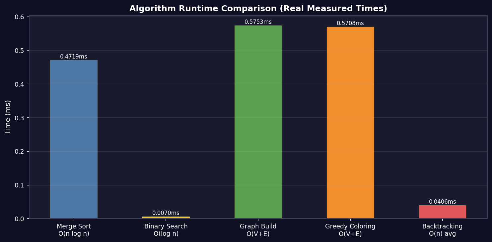
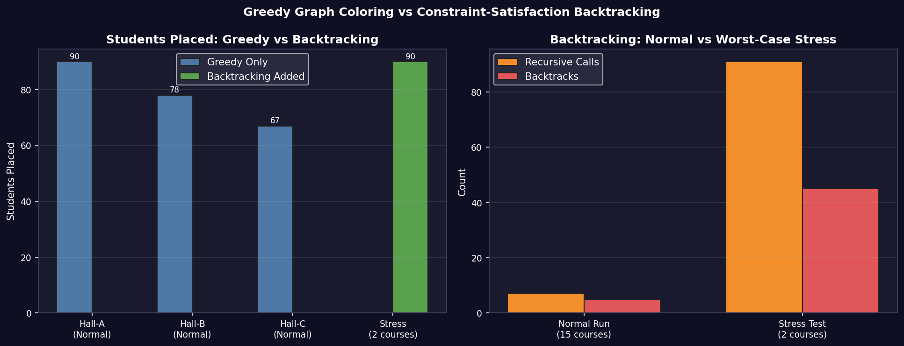
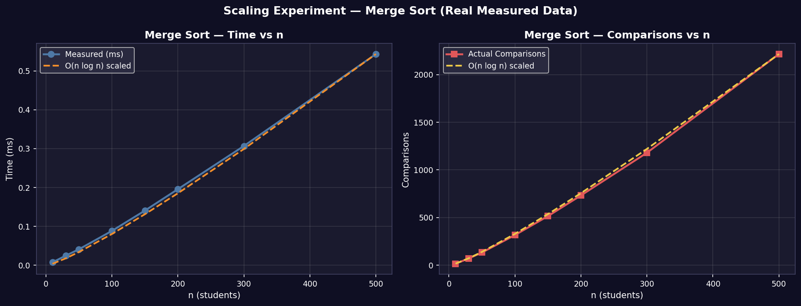
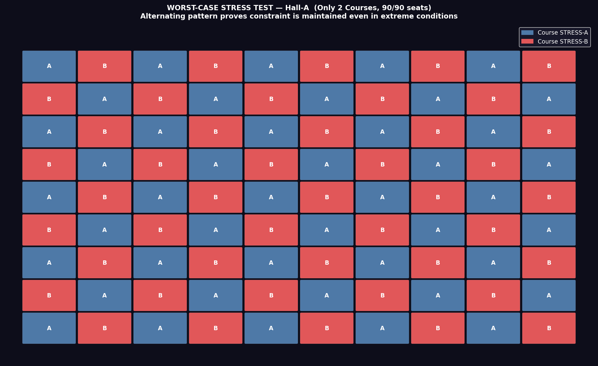

# Exam Seat Allocation System

A conflict-free exam seating allocator that assigns 240 students across 3 halls using graph coloring and constraint-satisfaction backtracking, with a full interactive GUI and algorithm complexity analysis — built as an Analysis of Algorithms course project.


## Overview

Seating students for an exam sounds simple until you enforce the real constraint: **no two adjacent seats can hold students from the same course**, across multiple halls of different sizes, with hundreds of students to place. This project treats that as what it actually is — a graph coloring and constraint-satisfaction problem — and solves it with a full classical-algorithms pipeline rather than a greedy hack:

- **Merge Sort + Binary Search** to organize and index students by course
- **Graph construction** modeling every seat as a node, with edges between adjacent seats
- **Greedy graph coloring** for a fast first-pass conflict-free assignment
- **Constraint-satisfaction backtracking** to resolve any seats the greedy pass can't place, with full recursion tracing
- A **7-tab interactive GUI** (CustomTkinter) to run the whole pipeline, inspect hall layouts, and step through the backtracking trace visually
- A **stress test** and **scaling experiment** to empirically validate time/space complexity against theory

## Results

| Hall | Seats | Placed | Conflicts |
|---|---|---|---|
| Hall-A | 90 | 90 | 0 |
| Hall-B | 80 | 78 | 0 |
| Hall-C | 70 | 67 | 0 |
| **Stress test (worst-case, 2 courses)** | **90** | **90** | **0** |

Zero seating conflicts across all halls, including the adversarial 2-course stress test designed to maximize backtracking pressure.

## Complexity analysis

| Algorithm | Time | Space |
|---|---|---|
| Merge Sort | O(n log n), all cases | O(n) |
| Binary Search | O(log n) | O(1) |
| Graph construction | O(V + E) | O(V + E) |
| Greedy coloring | O(V + E) | O(V) |
| Backtracking | O(n) average / O(n!) worst case | O(n) |

## Visual results

**Algorithm comparison** — greedy coloring vs. backtracking across metrics:



**Greedy vs. backtracking** performance under increasing constraint pressure:



**Scaling experiment** — empirical runtime growth vs. theoretical complexity:



**Stress test layout** — worst-case 2-course seating result:



## GUI

The app ships with a 7-tab interactive GUI (`gui.py`) built on CustomTkinter:

| Tab | What it shows |
|---|---|
| Hall Layout | Colour-coded seat grid per hall |
| Complexity | Scaling experiment + algorithm comparison charts |
| Trace Table | Backtracking recursion trace (green = PLACED, red = BACKTRACK) |
| Student Table | Searchable/sortable table of all placed students |
| Stress Test | Worst-case 2-course test with analysis charts |

## Project structure

```
├── main.py                  # Master pipeline (7 stages)
├── gui.py                   # Interactive 7-tab GUI
├── sorting.py                # Merge Sort + Binary Search
├── graph.py                  # Seat graph construction
├── coloring.py                # Greedy graph coloring
├── backtracking.py            # Constraint-satisfaction backtracking + stress test
├── visualization.py           # Chart generation
├── generate_data.py           # 240-student dataset generator
├── test_cases.py               # Test suite
├── space_complexity.py         # Memory profiling
├── data/
│   └── students.csv           # Generated 240-student dataset
├── output/
│   ├── seating_plan.csv        # Final seat assignments
│   └── halls/                  # Charts used in this README
└── requirements.txt
```

## Running locally

```bash
git clone https://github.com/SyedKashaaf/exam-seat-allocation-system.git
cd exam-seat-allocation-system
pip install -r requirements.txt
```

Tkinter must be installed (bundled with standard Python on Windows/macOS). On Ubuntu/Debian:
```bash
sudo apt-get install python3-tk
```

**Option 1 — Interactive GUI (recommended):**
```bash
python gui.py
```
Click **"Run All Steps"** in the sidebar to run the full pipeline.

**Option 2 — Command line:**
```bash
python generate_data.py     # Step 1: generate the dataset
python main.py               # Step 2: run all algorithms + generate charts
```

**Running tests:**
```bash
python test_cases.py
```

## Tech stack

Python · CustomTkinter · Matplotlib · NetworkX · Pandas · NumPy

## Future work

- Support for configurable hall shapes (non-grid seating layouts)
- Multi-exam scheduling across time slots, not just single-session allocation
- Web-based interface as an alternative to the desktop GUI
- Export to PDF seating charts per hall for print distribution

## Author

**Syed Muhammad Kashaaf Haider** — BS Artificial Intelligence, Capital University of Science and Technology (CUST), Islamabad
[GitHub](https://github.com/SyedKashaaf) · [LinkedIn](https://linkedin.com/in/syedkashaaf)

## License

MIT
